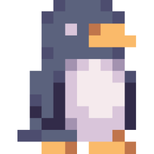

# OpenStarbound AppImage 🐧

  

| OpenStarbound URL | Starbound URL |
| :---: | :---: |
| [Click here](https://github.com/OpenStarbound/OpenStarbound) | [Click here](https://playstarbound.com/) |

Guide on how to build the portable OpenStarbound AppImage working on any Linux distro (with option to build vanilla Starbound too).

This repo only hosts the build files and instructions on how to build OpenStarbound and vanilla Starbound.  
Due to obvious legal reasons, we don't release AppImages directly and you need to provide legally acquired vanilla Starbound (from GOG) and OpenStarbound assets manually.

## Motivation

Linux game installers provided by GOG are not something that I find as well done.  
They are only good for providing DRM-free game files, but for running the games themself, they are bad.  
Games packed by GOG don't bundle all necessary dependencies + libraries and they use `LD_LIBRARY_PATH` hacks.  
This means that their Linux distro compatibility is based on luck and they are not portable in a single file like AppImage is.

Another motivation is that I think this makes it easier for people to install and try OpenStarbound.

## Building

Requirements:  
  - `x86_64` PC where building will occur
    - for example, cross-building `x86_64` AppImage from `aarch64` PC is not supported
  - Vanilla Starbound game assets from GOG installer
    - Steam version might also work, but it's not tested
  - `podman` or `docker` installed in PATH
    - for pulling the Arch container needed to build the AppImage
  - `wget` or `curl` installed in PATH
    - for downloading the Anylinux container AppImage setup action script
  - `awk` installed in PATH
    - for parsing the Anylinux container AppImage setup action script

Building steps:  
1. Open terminal
2. Change working directory where you want to save repo files (we'll use `~/Downloads` in this guide)
  - `cd ~/Downloads`
3. Clone this repo or download it manually and extract
  - `git clone https://github.com/pkgforge-dev/OpenStarbound-AppImage.git`
4. Change working directory to the repo folder
  - `cd ./OpenStarbound-AppImage`
5. Make `game-files` and `OpenStarbound` folders where the game assets are used
  - `mkdir game-files OpenStarbound`
6. Outside of terminal, provide Starbound and/or OpenStarbound assets if not provided
  - Starbound assets go into `game-files` folder in the repo
    - Starbound assets from GOG installer are located in `~/GOG Games/Starbound/game/*` folder
  - OpenStarbound assets go into `OpenStarbound` folder in the repo
    - OpenStarbound assets are located in these 2 folders after extracting tar files to `${PWD}`:
      - `./OpenStarbound-Linux-Clang-Server/server/server_distribution/*`
      - `./OpenStarbound-Linux-Clang-Client/client/client_distribution/*`
7. Run the building script depending if you want to build OpenStarbound or vanilla Starbound AppImage
  - OpenStarbound (version is supplied for cosmetic purposes for the filename of the AppImage - defaults to 0.0.0 if not supplied):
    - `OPENSTARBOUND_VERSION=0.1.14 ./build-locally.sh`
  - Vanilla Starbound (version is supplied for cosmetic purposes for the filename of the AppImage - defaults to 1.4.4 if not supplied):
    - `STARBOUND_VERSION=1.4.3 OPENSTARBOUND=0 ./build-locally.sh`
8. Building will begin. When it finishes, AppImage will be located in `./dist` folder
9. Enjoy!

Tested:  
  - OpenStarbound 0.1.14
  - Starbound 1.4.4

## AppImage Game Notes

- Due to the nature of the AppImage format, saving directory for storage, mods and logs is changed to:
  - `${XDG_DATA_HOME}/starbound/storage/`
  - `${XDG_DATA_HOME}/starbound/mods/`
  - `${XDG_DATA_HOME}/starbound/logs/`
- The above changes are applied and are overwritten to `sbinit.conf` on every app launch, as that's necessary for portable functionality to work. That means that this config is not for user modification.
  - `${XDG_CONFIG_HOME}/starbound/sbinit.config`
